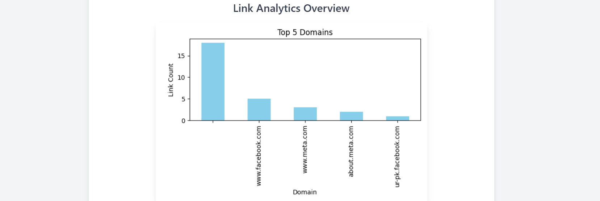

# 🔗 Link Scraper

A Django web application that scrapes all `<a>` tags from any given URL and displays the data in a table with interactive features. It also provides visual link analytics using **Matplotlib** charts.

---

## 📌 Features

- 🔍 Scrape anchor tags from any website
- 📋 Copy individual links with one click
- 📄 Export scraped links to CSV
- 🗑️ Delete links from the table
- 📊 Visualize link data using Matplotlib charts
- ✨ Clean and responsive UI with Tailwind CSS
- ⚡ Instant "Copied!" popup using JavaScript

---

## ⚙️ Tech Stack

- **Backend:** Django
- **Frontend:** HTML, Tailwind CSS, JavaScript
- **Web Scraping:** BeautifulSoup
- **Charts & Visualization:** Matplotlib
- **Data Export:** Pandas
- **Database:** SQLite

---

## 🗂 Project Structure

link_scraper/
├── scraper/
│ ├── templates/
│ │ └── result.html
│ ├── static/
│ │ └── js/copy.js
│ ├── views.py
│ ├── models.py
│ ├── urls.py
├── link_scraper/
│ └── settings.py
├── manage.py
└── README.md

---

## ✅ How to Use

1. **Enter** any valid website URL on the homepage.
2. **Click** on the `Scrape` button.

### 📊 View:

- All extracted `<a>` tag links displayed in a scrollable table.
- A domain-wise link frequency chart.

### 🛠️ Use:

- 📋 **Copy** button to copy any link.
- 🗑️ **Delete** button to remove a link.
- 📁 **Export CSV** button to download scraped data.

## 📊 Link Analysis with Matplotlib

After scraping, the app analyzes and visualizes:

- **Top domains** by frequency
- **Pie chart** showing distribution of link domains

These charts are generated dynamically using **Matplotlib**, rendered as PNG, and embedded in the results page using base64 encoding.

---

## 🧪 Installation

```bash
git clone https://github.com/Saymakh88/Web-scraper.git
cd mysite
python -m venv myenv
source env/bin/activate  # On Windows: env\Scripts\activate
pip install -r requirements.txt
python manage.py migrate
python manage.py runserver
```

## 🖼️ Screenshot

### 📌 Homepage UI


### 📌 Domain-wise Chart


(./static/images/scatterchart.png)

## 📡 Live Demo

🔗 [Click here to view the Live Project](https://sayma123.pythonanywhere.com/)
